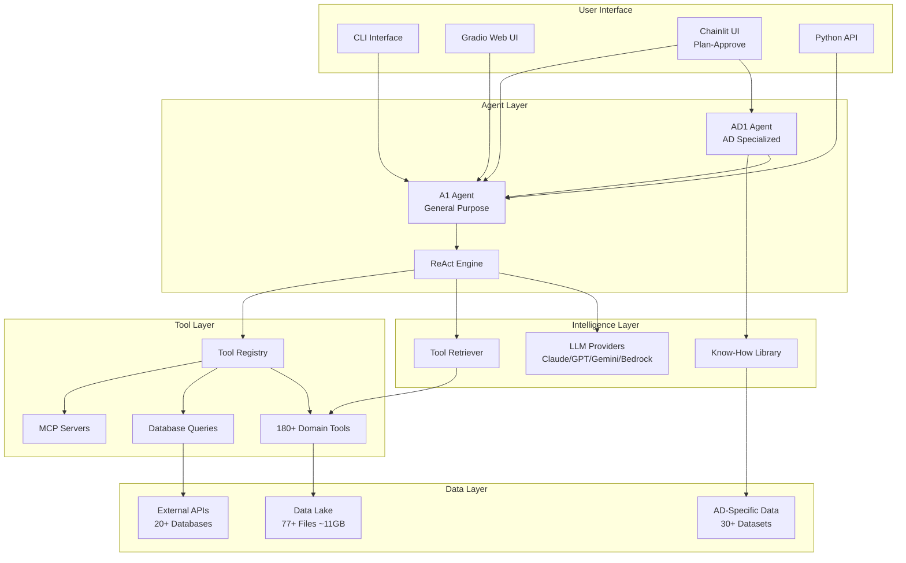
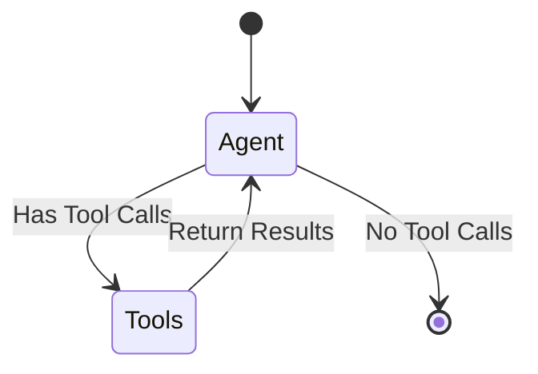

# Biomni-AD Architecture Documentation

## Overview

**Biomni-AD** is the Alzheimer's disease-specialized fork of [Biomni](https://github.com/snap-stanford/Biomni) (Stanford SNAP Lab), developed by Kuan-lin Huang, PhD. It introduces the AD1 agent, AD-specific data catalogs, and an interactive Chainlit UI with a plan-then-approve workflow.

The underlying **Biomni** platform is a general-purpose biomedical AI agent that enables autonomous execution of complex research tasks by integrating LLM reasoning with retrieval-augmented planning and code-based execution.

**Related docs:** [README.md](README.md) | [CONTRIBUTION.md](CONTRIBUTION.md) | [DETAILS.md](DETAILS.md) | [docs/configuration.md](docs/configuration.md)

---

## Table of Contents

1. [System Architecture](#system-architecture)
2. [Agent Framework](#agent-framework)
3. [Tool Ecosystem](#tool-ecosystem)
4. [Data Lake & Datasets](#data-lake--datasets)
5. [Know-How Library](#know-how-library)
6. [Alzheimer's Disease (AD) Specialization](#alzheimers-disease-ad-specialization)
7. [Software & Environment](#software--environment)
8. [Evaluation & Benchmarks](#evaluation--benchmarks)

---

## System Architecture



### Core Components

| Component | Location | Description |
|-----------|----------|-------------|
| **A1 Agent** | `biomni/agent/a1.py` | Main agent class with full tooling, MCP support, and the LangGraph ReAct state machine |
| **AD1 Agent** | `biomni/agent/ad1.py` | AD-specialized variant with context injection and Gradio UI |
| **Tool Registry** | `biomni/tool/tool_registry.py` | Dynamic tool registration and discovery |
| **Tool Retriever** | `biomni/model/retriever.py` | LLM-powered resource selection |
| **Config** | `biomni/config.py` | Centralized configuration: `BiomniConfig` dataclass and `resolve_default_llm()` env-precedence helper |
| **LLM Interface** | `biomni/llm.py` | Multi-provider LLM factory (OpenAI, Azure OpenAI, Anthropic, Azure Anthropic, Gemini, Groq, Ollama, Bedrock, Custom) |
| **Artifact Helpers** | `biomni/artifact.py` | Shared run-id generation and filesystem snapshotting used by both A1 and the Chainlit UI to keep their exclude lists in sync |

---

## Agent Framework

### ReAct Paradigm

The agent uses a **Reasoning + Acting (ReAct)** workflow implemented as a LangGraph state machine:



### Key Agent Features

| Feature | Description |
|---------|-------------|
| **Tool Retrieval** | LLM-based selection of relevant tools from registry |
| **Timeout Management** | Configurable execution timeouts (default: 600s) |
| **MCP Integration** | Model Context Protocol support for external tools |
| **Custom Tools** | Runtime tool addition via `add_tool()` method |
| **Commercial Mode** | License-aware mode filtering non-commercial content |
| **PDF Generation** | Execution trace export to PDF reports |

### Agent Initialization

```python
# Either the short top-level path (recommended) ...
from biomni import A1
# ... or the explicit submodule path (still supported)
# from biomni.agent.a1 import A1

agent = A1(
    path='./data',                    # Data directory
    llm='claude-sonnet-4-20250514',   # LLM model
    source='Anthropic',               # Provider
    use_tool_retriever=True,          # Enable smart retrieval
    timeout_seconds=600,              # Execution timeout
    commercial_mode=False             # License filtering
)
```

`A1`, `AD1`, and `BiomniConfig` are lazy-loaded on first attribute access, so
`import biomni` itself stays cheap and does not pull in pandas / langchain
until you actually instantiate an agent.

---

## Tool Ecosystem

### Tool Categories

Biomni provides **180+ tools** organized into **20 biomedical domains**:

| Domain | File | Tools | Description |
|--------|------|-------|-------------|
| **Biochemistry** | `biochemistry.py` | ~15 | Molecular structure, protein analysis |
| **Bioengineering** | `bioengineering.py` | ~20 | CRISPR, synthetic biology |
| **Bioimaging** | `bioimaging.py` | ~18 | Microscopy, histopathology |
| **Biophysics** | `biophysics.py` | ~8 | Molecular dynamics, simulations |
| **Cancer Biology** | `cancer_biology.py` | ~18 | DepMap, oncogenomics |
| **Cell Biology** | `cell_biology.py` | ~12 | Single-cell analysis |
| **Database** | `database.py` | **53** | External API queries |
| **Genetics** | `genetics.py` | ~20 | GWAS, variant analysis |
| **Genomics** | `genomics.py` | ~35 | NGS, sequence analysis |
| **Glycoengineering** | `glycoengineering.py` | ~5 | Glycan analysis |
| **Immunology** | `immunology.py` | ~25 | TCR, immune profiling |
| **Lab Automation** | `lab_automation.py` | ~8 | PyLabRobot integration |
| **Literature** | `literature.py` | ~8 | PubMed, arXiv search |
| **Microbiology** | `microbiology.py` | ~20 | Microbiome, phylogenetics |
| **Molecular Biology** | `molecular_biology.py` | ~30 | Cloning, primers |
| **Pathology** | `pathology.py` | ~15 | Histology analysis |
| **Pharmacology** | `pharmacology.py` | ~45 | Drug discovery, ADMET |
| **Physiology** | `physiology.py` | ~18 | Organ systems |
| **Synthetic Biology** | `synthetic_biology.py` | ~18 | Plasmid design |
| **Systems Biology** | `systems_biology.py` | ~15 | Network analysis |

### Database Query Tools (53 Functions)

The `database.py` module provides natural language interfaces to major biomedical databases:

| Function | External Source | Data Type |
|----------|----------------|-----------|
| `query_uniprot` | UniProt | Protein sequences, annotations |
| `query_alphafold` | AlphaFold DB | Protein structure predictions |
| `query_pdb` | RCSB PDB | 3D protein structures |
| `query_interpro` | InterPro | Protein domains/families |
| `query_ensembl` | Ensembl | Genomic features |
| `query_clinvar` | NCBI ClinVar | Clinical variants |
| `query_dbsnp` | NCBI dbSNP | SNP annotations |
| `query_geo` | NCBI GEO | Expression datasets |
| `query_kegg` | KEGG | Pathways, compounds |
| `query_stringdb` | STRING | Protein interactions |
| `query_cbioportal` | cBioPortal | Cancer genomics |
| `query_gwas_catalog` | GWAS Catalog | Association studies |
| `query_gnomad` | gnomAD | Population variants |
| `query_opentarget` | Open Targets | Drug targets |
| `query_monarch` | Monarch Initiative | Disease-gene-phenotype |
| `query_openfda` | OpenFDA | Drug labels, adverse events |
| `query_reactome` | Reactome | Biological pathways |
| `query_regulomedb` | RegulomeDB | Regulatory elements |
| `query_pride` | PRIDE | Proteomics data |
| `query_gtopdb` | GtoPdb | Pharmacology |
| `query_ucsc` | UCSC Genome | Genome browser |
| `query_jaspar` | JASPAR | TF binding motifs |
| `query_iucn` | IUCN Red List | Species conservation |
| `query_paleobiology` | PBDB | Fossil records |
| `query_worms` | WoRMS | Marine species |
| `query_remap` | ReMap | TF binding sites |
| `blast_sequence` | NCBI BLAST | Sequence homology |
| `region_to_ccre_screen` | ENCODE SCREEN | Regulatory elements |
| `get_genes_near_ccre` | ENCODE | Gene-cCRE relationships |
| `get_hpo_names` | HPO | Phenotype ontology |

### Tool Description Schema

Each tool has a corresponding schema in `biomni/tool/tool_description/`:

```python
# Example from tool_description/database.py
{
    "name": "query_uniprot",
    "description": "Query UniProt for protein information",
    "parameters": {
        "prompt": {"type": "string", "description": "Natural language query"},
        "endpoint": {"type": "string", "description": "Direct API endpoint"},
        "max_results": {"type": "integer", "default": 5}
    }
}
```

---

## Data Lake & Datasets

### Overview

The data lake contains **77 curated datasets** (~11GB) automatically downloaded on first run:

```
./data/
├── data_lake/           # ~11GB of curated datasets
│   ├── *.parquet        # Tabular data files
│   ├── *.pkl            # Serialized Python objects
│   ├── *.csv            # CSV files
│   └── *.json           # Ontologies
├── biomniad/            # AD-specific data
└── benchmark_data/      # Evaluation datasets
```

### Data Lake Contents

| Category | Files | Description |
|----------|-------|-------------|
| **Gene Sets (MSigDB)** | 10 | Hallmark, oncogenic, immunologic signatures |
| **Gene Sets (MouseMine)** | 5 | Positional, curated, regulatory sets |
| **Protein Interactions** | 8 | Affinity capture, co-fractionation, two-hybrid |
| **Drug Discovery** | 10 | BindingDB, Broad Repurposing Hub, DDInter |
| **Genetic Variants** | 6 | GeneBass, GWAS Catalog, variant tables |
| **Gene Expression** | 4 | GTEx, DepMap, Protein Atlas |
| **Disease Associations** | 4 | DisGeNET, OMIM, HPO |
| **Cell Biology** | 3 | CZI Census, cell type markers |
| **CRISPR** | 3 | sgRNA libraries, DepMap dependencies |
| **microRNA** | 4 | miRDB, miRTarBase targets |
| **Viral/Immune** | 3 | Virus-host PPI, TCR sequences |
| **Knowledge Graphs** | 2 | TxGNN, precision medicine KG |
| **Ontologies** | 2 | Gene Ontology, HPO |

### Key Dataset Details

| Dataset | Description | Size |
|---------|-------------|------|
| `BindingDB_All_202409.tsv` | Drug-target binding affinities | Large |
| `DepMap_CRISPRGeneEffect.csv` | Genome-wide CRISPR effects | ~2GB |
| `gtex_tissue_gene_tpm.parquet` | GTEx expression across tissues | ~500MB |
| `gwas_catalog.pkl` | GWAS association results | ~100MB |
| `kg.csv` | Precision medicine knowledge graph (17,080 diseases, 4M+ relationships) | ~200MB |
| `DisGeNET.parquet` | Gene-disease associations | ~100MB |

---

## Know-How Library

The Know-How Library provides domain expertise automatically retrieved during agent reasoning:

### Structure

```
biomni/know_how/
├── __init__.py
├── loader.py              # Know-How loading and retrieval
├── single_cell_annotation.md   # scRNA-seq best practices
├── sgRNA_design_guide.md       # CRISPR design guidelines
├── biomniAD_data_sourcing.md   # AD data access guide
└── resource/
    ├── NIAGADS_datasets_with_files.json  # 27 AD datasets
    ├── SinaiADRD.json                     # 5 Sinai AD datasets
    ├── CRISPick_download_links.txt        # CRISPR resources
    └── addgene_grna_sequences.csv         # gRNA library
```

### Know-How Document Features

- **Automatic Retrieval**: Matched to queries based on relevance
- **Metadata Tracking**: Authors, affiliations, licensing
- **Commercial Mode Compatible**: Filters non-commercial content

---

## Alzheimer's Disease (AD) Specialization

### AD1 Agent

The `AD1` agent extends `A1` with AD-specific capabilities:

```python
from biomni.agent.ad1 import AD1

agent = AD1(llm='claude-sonnet-4-20250514')
agent.go("Analyze APOE variants in Alzheimer's disease")
```

**Key Features:**
- Automatic AD context injection when queries match keywords
- Pre-loaded AD dataset catalogs
- Specialized UI with run history tracking
- Notebook and artifact generation

### AD Data Catalogs

#### NIAGADS Datasets (27 Studies)

| ID | Title | Data Type |
|----|-------|-----------|
| NG00049 | CSF Summary Statistics (Cruchaga 2013) | CSF biomarkers GWAS |
| NG00067 | ADSP Umbrella | WES/WGS, structural variants |
| NG00075 | IGAP Rare Variant (Kunkle 2019) | Rare variant meta-analysis |
| NG00100 | African American AD Risk (Kunkle 2021) | Multi-ancestry GWAS |
| NG00102 | Genomic Atlas of Proteome | Brain/CSF/Plasma pQTLs |
| NG00103 | RBFOX1 and Brain Amyloidosis | Amyloid PET GWAS |
| NG00105 | MiGA Microglia Atlas | Microglia eQTLs/sQTLs |
| NG00118 | AMP-AD Structural Variants | SV-xQTL analysis |
| NG00126 | ADSP Variant Artifact Removal | Quality filtering |
| NG00148 | Rare Variant Aggregation | Discovery cohort analysis |
| NG00156 | Resilience Variants | Protective genetic factors |
| NG00157-161 | Sex-Specific Genetics | Sex-stratified GWAS |
| NG00165-166 | CHARGE & ADSP R3 | Multi-cohort association |
| NG00169-172 | PSP Summary Statistics | Progressive supranuclear palsy |
| NG00175-182 | Multi-Omic Endophenotypes | Proteomics, metabolomics QTLs |

#### Sinai/Other AD Datasets (5 Studies)

| ID | Title | Data Type |
|----|-------|-----------|
| RADR | Repository for Rare AD Variants | Curated variant database |
| SingleBrain | snRNA-seq eQTL Meta-analysis | Brain cell-type eQTLs |
| GCST90027158 | Bellenguez et al. 2022 GWAS | Large AD meta-analysis |
| isoMiGA (counts) | Microglia Isoform Expression | Gene/isoform quantification |
| isoMiGA (QTL) | Microglia Expression QTLs | eQTL/sQTL summary stats |

### CRISPRbrain API Integration

```python
import crisprbrain

client = crisprbrain.Client()
screen = client.screens["Glutamatergic Neuron-Survival-CRISPRi"]
df = screen.to_data_frame()
```

### AD Context Injection

When queries match AD keywords (Alzheimer, dementia, MCI, amyloid, tau, neurodegeneration, cognition), the AD1 agent automatically:

1. Scans local `BiomniAD*.json` catalogs
2. Summarizes relevant datasets
3. Downloads needed subsets to `data/biomniad/`
4. Injects dataset references into agent context

---

## Software & Environment

### Python Packages (100+)

| Category | Key Packages |
|----------|--------------|
| **Bioinformatics** | biopython, scanpy, anndata, mudata, gget, pysam |
| **Single-Cell** | scvelo, scrublet, cellxgene-census, pyscenic |
| **Genomics** | pyranges, pybedtools, pyliftover, cyvcf2 |
| **Drug Discovery** | rdkit, deeppurpose, pytdc, pyscreener |
| **Structural Biology** | openmm, pdbfixer, openbabel |
| **Data Science** | pandas, numpy, scipy, scikit-learn |
| **Visualization** | matplotlib, seaborn, umap-learn |
| **Deep Learning** | nnunet, cellpose, harmony-pytorch |

### R Packages

| Package | Purpose |
|---------|---------|
| DESeq2 | Differential expression |
| edgeR | RNA-seq analysis |
| limma | Microarray analysis |
| WGCNA | Co-expression networks |
| clusterProfiler | Pathway enrichment |
| harmony | Data integration |
| ggplot2/dplyr/tidyr | Data manipulation |

### CLI Tools

| Tool | Purpose |
|------|---------|
| samtools | SAM/BAM processing |
| bowtie2/bwa | Sequence alignment |
| bedtools | Genomic operations |
| macs2 | ChIP-seq peaks |
| plink/plink2 | GWAS analysis |
| gcta64 | Complex trait analysis |
| iqtree2 | Phylogenetics |
| FastTree | Fast phylogenetic trees |
| mafft/muscle | Sequence alignment |
| Homer | Motif discovery |
| diamond | Protein search |
| vina/autosite | Molecular docking |

### Environment Setup

Two install paths, depending on what you need:

**Lightweight** — agent core only, no R / heavy bio CLI tools:

```bash
pip install -e .                  # core deps (LangChain + OpenAI)
pip install -e ".[anthropic]"     # add Claude provider
pip install -e ".[all]"           # all provider + UI extras (anthropic, bedrock, ollama, gradio, chainlit)
```

**Full conda env** — everything including R, bioinformatics CLI tools, and the
22 domain-specific tool modules:

```bash
cd biomni_env
./setup.sh                  # ~10h install, ~30GB disk
conda activate biomni_e1
pip install -e ..           # link the package into the conda env
```

See [`biomni_env/README.md`](./biomni_env/README.md) for the role of each
YAML file in `biomni_env/`.

---

## Evaluation & Benchmarks

### Biomni-Eval1

A comprehensive benchmark with **433 instances** across **10 biological reasoning tasks**:

| Task | Variants | Description |
|------|----------|-------------|
| GWAS Causal Gene | 3 | Identify causal genes from GWAS loci |
| Lab Bench Q&A | 2 | Answer biological research questions |
| Patient Gene Detection | 1 | Identify disease genes from patient data |
| Screen Gene Retrieval | 1 | Select genes from CRISPR screens |
| GWAS Variant Prioritization | 1 | Rank variants by functional impact |
| Rare Disease Diagnosis | 1 | Diagnose from phenotype descriptions |
| CRISPR Delivery Selection | 1 | Choose delivery methods |

### Task Classes

Base task interface in `biomni/task/base_task.py`:

```python
class BaseTask:
    def __init__(self): pass
    def __len__(self): pass
    def get_example(self, index): pass
    def evaluate(self): pass
    def output_class(self): pass
```

### Implemented Tasks

- `hle.py`: Humanity's Last Exam benchmark
- `lab_bench.py`: Lab bench dataset evaluation

---

## Summary Statistics

| Component | Count |
|-----------|-------|
| **Domain Tool Modules** | 20 |
| **Total Tools** | 180+ |
| **Database Query Functions** | 53 |
| **Data Lake Files** | 77 |
| **AD-Specific Datasets** | 32 |
| **Python Packages** | 100+ |
| **R Packages** | 10+ |
| **CLI Tools** | 20+ |
| **Evaluation Tasks** | 10 |
| **Lines of Code (Agent)** | ~4000 |

---

## License & Citation

Biomni is **Apache 2.0 licensed**, but individual tools and datasets may carry more restrictive licenses.

```bibtex
@article{huang2025biomni,
  title={Biomni: A General-Purpose Biomedical AI Agent},
  author={Huang, Kexin and Zhang, Serena and Wang, Hanchen and others},
  journal={bioRxiv},
  year={2025}
}
```

---

*Last updated: March 2026*
