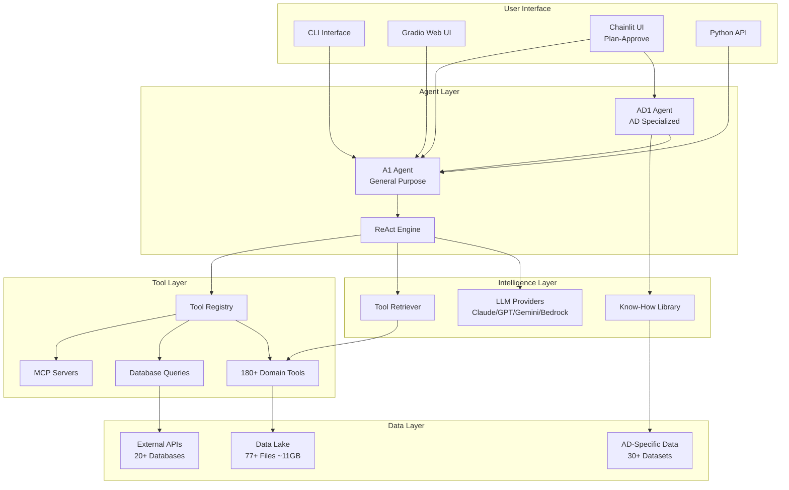
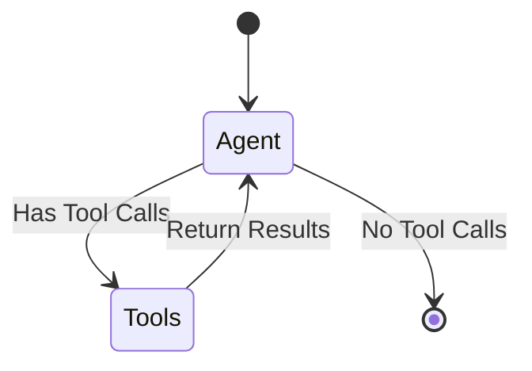
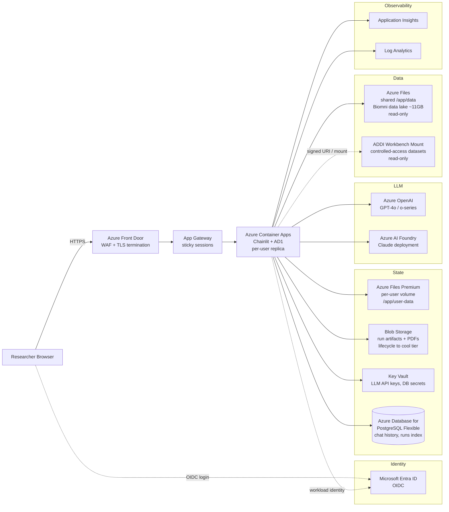

# Biomni-AD Architecture Documentation

## Overview

**Biomni-AD** is the Alzheimer's disease-specialized fork of [Biomni](https://github.com/snap-stanford/Biomni) (Stanford SNAP Lab), maintained by Kuan-lin Huang, PhD at **[Kaimen Inc.](https://github.com/Kaimen-Inc/Biomni-AD)**. It introduces the AD1 agent, AD-specific data catalogs, and an interactive Chainlit UI with a plan-then-approve workflow.

The underlying **Biomni** platform is a general-purpose biomedical AI agent that enables autonomous execution of complex research tasks by integrating LLM reasoning with retrieval-augmented planning and code-based execution.

Biomni-AD is committed to remaining fully open source and is being prepared for deployment on the **Alzheimer's Disease Data Initiative (ADDI)** workbench to serve AD researchers at scale. See [Cloud Deployment Architecture](#cloud-deployment-architecture) below for the target deployment topology.

**Related docs:** [README.md](README.md) | [CONTRIBUTION.md](CONTRIBUTION.md) | [DETAILS.md](DETAILS.md) | [docs/configuration.md](docs/configuration.md)

---

## Table of Contents

1. [System Architecture](#system-architecture)
2. [Agent Framework](#agent-framework)
3. [Tool Ecosystem](#tool-ecosystem)
4. [Data Lake & Datasets](#data-lake--datasets)
5. [Know-How Library](#know-how-library)
6. [Alzheimer's Disease (AD) Specialization](#alzheimers-disease-ad-specialization)
7. [Software & Environment](#software--environment)
8. [Evaluation & Benchmarks](#evaluation--benchmarks)
9. [Cloud Deployment Architecture](#cloud-deployment-architecture)

---

## System Architecture



### Core Components

| Component | Location | Description |
|-----------|----------|-------------|
| **A1 Agent** | `biomni/agent/a1.py` | Main agent class with full tooling, MCP support, and the LangGraph ReAct state machine |
| **AD1 Agent** | `biomni/agent/ad1.py` | AD-specialized variant with AD-context injection and dataset catalog awareness |
| **AD Data Downloader** | `biomni/agent/ad_data_downloader.py` | Catalog-driven download of NIAGADS / SinaiADRD / BiomniAD Discovery files (≤100 MB) |
| **Chainlit App** | `chainlit_app.py`, `chainlit_ui/` | Plan-then-approve web UI used as the default interactive front-end |
| **Tool Registry** | `biomni/tool/tool_registry.py` | Dynamic tool registration and discovery |
| **Tool Retriever** | `biomni/model/retriever.py` | LLM-powered resource selection |
| **Config** | `biomni/config.py` | Centralized configuration: `BiomniConfig` dataclass and `resolve_default_llm()` env-precedence helper |
| **LLM Interface** | `biomni/llm.py` | Multi-provider LLM factory (OpenAI, Azure OpenAI, Anthropic, Azure Anthropic, Gemini, Groq, Ollama, Bedrock, Custom) |
| **Artifact Helpers** | `biomni/artifact.py` | Shared run-id generation and filesystem snapshotting used by both A1 and the Chainlit UI to keep their exclude lists in sync |

---

## Agent Framework

### ReAct Paradigm

The agent uses a **Reasoning + Acting (ReAct)** workflow implemented as a LangGraph state machine:



### Key Agent Features

| Feature | Description |
|---------|-------------|
| **Tool Retrieval** | LLM-based selection of relevant tools from registry |
| **Timeout Management** | Configurable execution timeouts (default: 600s) |
| **MCP Integration** | Model Context Protocol support for external tools |
| **Custom Tools** | Runtime tool addition via `add_tool()` method |
| **Commercial Mode** | License-aware mode filtering non-commercial content |
| **PDF Generation** | Execution trace export to PDF reports |

### Agent Initialization

```python
# Either the short top-level path (recommended) ...
from biomni import A1
# ... or the explicit submodule path (still supported)
# from biomni.agent.a1 import A1

agent = A1(
    path='./data',                    # Data directory
    llm='claude-sonnet-4-20250514',   # LLM model
    source='Anthropic',               # Provider
    use_tool_retriever=True,          # Enable smart retrieval
    timeout_seconds=600,              # Execution timeout
    commercial_mode=False             # License filtering
)
```

`A1`, `AD1`, and `BiomniConfig` are lazy-loaded on first attribute access, so
`import biomni` itself stays cheap and does not pull in pandas / langchain
until you actually instantiate an agent.

---

## Tool Ecosystem

### Tool Categories

Biomni provides **180+ tools** organized into **20 biomedical domains**:

| Domain | File | Tools | Description |
|--------|------|-------|-------------|
| **Biochemistry** | `biochemistry.py` | ~15 | Molecular structure, protein analysis |
| **Bioengineering** | `bioengineering.py` | ~20 | CRISPR, synthetic biology |
| **Bioimaging** | `bioimaging.py` | ~18 | Microscopy, histopathology |
| **Biophysics** | `biophysics.py` | ~8 | Molecular dynamics, simulations |
| **Cancer Biology** | `cancer_biology.py` | ~18 | DepMap, oncogenomics |
| **Cell Biology** | `cell_biology.py` | ~12 | Single-cell analysis |
| **Database** | `database.py` | **53** | External API queries |
| **Genetics** | `genetics.py` | ~20 | GWAS, variant analysis |
| **Genomics** | `genomics.py` | ~35 | NGS, sequence analysis |
| **Glycoengineering** | `glycoengineering.py` | ~5 | Glycan analysis |
| **Immunology** | `immunology.py` | ~25 | TCR, immune profiling |
| **Lab Automation** | `lab_automation.py` | ~8 | PyLabRobot integration |
| **Literature** | `literature.py` | ~8 | PubMed, arXiv search |
| **Microbiology** | `microbiology.py` | ~20 | Microbiome, phylogenetics |
| **Molecular Biology** | `molecular_biology.py` | ~30 | Cloning, primers |
| **Pathology** | `pathology.py` | ~15 | Histology analysis |
| **Pharmacology** | `pharmacology.py` | ~45 | Drug discovery, ADMET |
| **Physiology** | `physiology.py` | ~18 | Organ systems |
| **Synthetic Biology** | `synthetic_biology.py` | ~18 | Plasmid design |
| **Systems Biology** | `systems_biology.py` | ~15 | Network analysis |

### Database Query Tools (53 Functions)

The `database.py` module provides natural language interfaces to major biomedical databases:

| Function | External Source | Data Type |
|----------|----------------|-----------|
| `query_uniprot` | UniProt | Protein sequences, annotations |
| `query_alphafold` | AlphaFold DB | Protein structure predictions |
| `query_pdb` | RCSB PDB | 3D protein structures |
| `query_interpro` | InterPro | Protein domains/families |
| `query_ensembl` | Ensembl | Genomic features |
| `query_clinvar` | NCBI ClinVar | Clinical variants |
| `query_dbsnp` | NCBI dbSNP | SNP annotations |
| `query_geo` | NCBI GEO | Expression datasets |
| `query_kegg` | KEGG | Pathways, compounds |
| `query_stringdb` | STRING | Protein interactions |
| `query_cbioportal` | cBioPortal | Cancer genomics |
| `query_gwas_catalog` | GWAS Catalog | Association studies |
| `query_gnomad` | gnomAD | Population variants |
| `query_opentarget` | Open Targets | Drug targets |
| `query_monarch` | Monarch Initiative | Disease-gene-phenotype |
| `query_openfda` | OpenFDA | Drug labels, adverse events |
| `query_reactome` | Reactome | Biological pathways |
| `query_regulomedb` | RegulomeDB | Regulatory elements |
| `query_pride` | PRIDE | Proteomics data |
| `query_gtopdb` | GtoPdb | Pharmacology |
| `query_ucsc` | UCSC Genome | Genome browser |
| `query_jaspar` | JASPAR | TF binding motifs |
| `query_iucn` | IUCN Red List | Species conservation |
| `query_paleobiology` | PBDB | Fossil records |
| `query_worms` | WoRMS | Marine species |
| `query_remap` | ReMap | TF binding sites |
| `blast_sequence` | NCBI BLAST | Sequence homology |
| `region_to_ccre_screen` | ENCODE SCREEN | Regulatory elements |
| `get_genes_near_ccre` | ENCODE | Gene-cCRE relationships |
| `get_hpo_names` | HPO | Phenotype ontology |

### Tool Description Schema

Each tool has a corresponding schema in `biomni/tool/tool_description/`:

```python
# Example from tool_description/database.py
{
    "name": "query_uniprot",
    "description": "Query UniProt for protein information",
    "parameters": {
        "prompt": {"type": "string", "description": "Natural language query"},
        "endpoint": {"type": "string", "description": "Direct API endpoint"},
        "max_results": {"type": "integer", "default": 5}
    }
}
```

---

## Data Lake & Datasets

### Overview

The data lake contains **77 curated datasets** (~11GB), catalogued in `biomni/env_desc.py` regardless of what's on disk.
Individual files are fetched lazily from S3, the first time a query actually selects them (`A1._ensure_data_lake_files`) — not downloaded in bulk on agent construction.
Layout once files are present:

```
./data/
├── data_lake/           # ~11GB of curated datasets
│   ├── *.parquet        # Tabular data files
│   ├── *.pkl            # Serialized Python objects
│   ├── *.csv            # CSV files
│   └── *.json           # Ontologies
├── biomniad/            # AD-specific data
└── benchmark_data/      # Evaluation datasets
```

### Data Lake Contents

| Category | Files | Description |
|----------|-------|-------------|
| **Gene Sets (MSigDB)** | 10 | Hallmark, oncogenic, immunologic signatures |
| **Gene Sets (MouseMine)** | 5 | Positional, curated, regulatory sets |
| **Protein Interactions** | 8 | Affinity capture, co-fractionation, two-hybrid |
| **Drug Discovery** | 10 | BindingDB, Broad Repurposing Hub, DDInter |
| **Genetic Variants** | 6 | GeneBass, GWAS Catalog, variant tables |
| **Gene Expression** | 4 | GTEx, DepMap, Protein Atlas |
| **Disease Associations** | 4 | DisGeNET, OMIM, HPO |
| **Cell Biology** | 3 | CZI Census, cell type markers |
| **CRISPR** | 3 | sgRNA libraries, DepMap dependencies |
| **microRNA** | 4 | miRDB, miRTarBase targets |
| **Viral/Immune** | 3 | Virus-host PPI, TCR sequences |
| **Knowledge Graphs** | 2 | TxGNN, precision medicine KG |
| **Ontologies** | 2 | Gene Ontology, HPO |

### Key Dataset Details

| Dataset | Description | Size |
|---------|-------------|------|
| `BindingDB_All_202409.tsv` | Drug-target binding affinities | Large |
| `DepMap_CRISPRGeneEffect.csv` | Genome-wide CRISPR effects | ~2GB |
| `gtex_tissue_gene_tpm.parquet` | GTEx expression across tissues | ~500MB |
| `gwas_catalog.pkl` | GWAS association results | ~100MB |
| `kg.csv` | Precision medicine knowledge graph (17,080 diseases, 4M+ relationships) | ~200MB |
| `DisGeNET.parquet` | Gene-disease associations | ~100MB |

---

## Know-How Library

The Know-How Library provides domain expertise automatically retrieved during agent reasoning:

### Structure

```
biomni/know_how/
├── __init__.py
├── loader.py              # Know-How loading and retrieval
├── single_cell_annotation.md   # scRNA-seq best practices
├── sgRNA_design_guide.md       # CRISPR design guidelines
├── biomniAD_data_sourcing.md   # AD data access guide
└── resource/
    ├── NIAGADS_datasets_with_files.json  # 27 AD datasets
    ├── SinaiADRD.json                     # 5 Sinai AD datasets
    ├── CRISPick_download_links.txt        # CRISPR resources
    └── addgene_grna_sequences.csv         # gRNA library
```

### Know-How Document Features

- **Automatic Retrieval**: Matched to queries based on relevance
- **Metadata Tracking**: Authors, affiliations, licensing
- **Commercial Mode Compatible**: Filters non-commercial content

---

## Alzheimer's Disease (AD) Specialization

### AD1 Agent

The `AD1` agent extends `A1` with AD-specific capabilities:

```python
from biomni.agent.ad1 import AD1

agent = AD1(llm='claude-sonnet-4-5')
agent.go("Analyze APOE variants in Alzheimer's disease")
```

**Key Features:**
- Automatic AD context injection when queries match AD/ADRD keywords
- Pre-loaded NIAGADS / SinaiADRD / BiomniAD Discovery / CRISPRbrain catalogs
- Chainlit plan-then-approve UI with run history tracking
- Per-run artifact snapshots and PDF / notebook export

### AD Data Catalogs

#### NIAGADS Datasets (27 Studies)

| ID | Title | Data Type |
|----|-------|-----------|
| NG00049 | CSF Summary Statistics (Cruchaga 2013) | CSF biomarkers GWAS |
| NG00067 | ADSP Umbrella | WES/WGS, structural variants |
| NG00075 | IGAP Rare Variant (Kunkle 2019) | Rare variant meta-analysis |
| NG00100 | African American AD Risk (Kunkle 2021) | Multi-ancestry GWAS |
| NG00102 | Genomic Atlas of Proteome | Brain/CSF/Plasma pQTLs |
| NG00103 | RBFOX1 and Brain Amyloidosis | Amyloid PET GWAS |
| NG00105 | MiGA Microglia Atlas | Microglia eQTLs/sQTLs |
| NG00118 | AMP-AD Structural Variants | SV-xQTL analysis |
| NG00126 | ADSP Variant Artifact Removal | Quality filtering |
| NG00148 | Rare Variant Aggregation | Discovery cohort analysis |
| NG00156 | Resilience Variants | Protective genetic factors |
| NG00157-161 | Sex-Specific Genetics | Sex-stratified GWAS |
| NG00165-166 | CHARGE & ADSP R3 | Multi-cohort association |
| NG00169-172 | PSP Summary Statistics | Progressive supranuclear palsy |
| NG00175-182 | Multi-Omic Endophenotypes | Proteomics, metabolomics QTLs |

#### Sinai/Other AD Datasets (5 Studies)

| ID | Title | Data Type |
|----|-------|-----------|
| RADR | Repository for Rare AD Variants | Curated variant database |
| SingleBrain | snRNA-seq eQTL Meta-analysis | Brain cell-type eQTLs |
| GCST90027158 | Bellenguez et al. 2022 GWAS | Large AD meta-analysis |
| isoMiGA (counts) | Microglia Isoform Expression | Gene/isoform quantification |
| isoMiGA (QTL) | Microglia Expression QTLs | eQTL/sQTL summary stats |

### CRISPRbrain API Integration

```python
import crisprbrain

client = crisprbrain.Client()
screen = client.screens["Glutamatergic Neuron-Survival-CRISPRi"]
df = screen.to_data_frame()
```

### AD Context Injection

When queries match AD keywords (Alzheimer, dementia, MCI, amyloid, tau, neurodegeneration, cognition), the AD1 agent automatically:

1. Scans local `BiomniAD*.json` catalogs
2. Summarizes relevant datasets
3. Downloads needed subsets to `data/biomniad/`
4. Injects dataset references into agent context

---

## Software & Environment

### Python Packages (100+)

| Category | Key Packages |
|----------|--------------|
| **Bioinformatics** | biopython, scanpy, anndata, mudata, gget, pysam |
| **Single-Cell** | scvelo, scrublet, cellxgene-census, pyscenic |
| **Genomics** | pyranges, pybedtools, pyliftover, cyvcf2 |
| **Drug Discovery** | rdkit, deeppurpose, pytdc, pyscreener |
| **Structural Biology** | openmm, pdbfixer, openbabel |
| **Data Science** | pandas, numpy, scipy, scikit-learn |
| **Visualization** | matplotlib, seaborn, umap-learn |
| **Deep Learning** | nnunet, cellpose, harmony-pytorch |

### R Packages

| Package | Purpose |
|---------|---------|
| DESeq2 | Differential expression |
| edgeR | RNA-seq analysis |
| limma | Microarray analysis |
| WGCNA | Co-expression networks |
| clusterProfiler | Pathway enrichment |
| harmony | Data integration |
| ggplot2/dplyr/tidyr | Data manipulation |

### CLI Tools

| Tool | Purpose |
|------|---------|
| samtools | SAM/BAM processing |
| bowtie2/bwa | Sequence alignment |
| bedtools | Genomic operations |
| macs2 | ChIP-seq peaks |
| plink/plink2 | GWAS analysis |
| gcta64 | Complex trait analysis |
| iqtree2 | Phylogenetics |
| FastTree | Fast phylogenetic trees |
| mafft/muscle | Sequence alignment |
| Homer | Motif discovery |
| diamond | Protein search |
| vina/autosite | Molecular docking |

### Environment Setup

Two install paths, depending on what you need:

**Lightweight** — agent core only, no R / heavy bio CLI tools:

```bash
pip install -e .                  # core deps (LangChain + OpenAI)
pip install -e ".[anthropic]"     # add Claude provider
pip install -e ".[all]"           # all provider + UI extras (anthropic, bedrock, ollama, gradio, chainlit)
```

**Full conda env** — everything including R, bioinformatics CLI tools, and the
22 domain-specific tool modules:

```bash
cd biomni_env
./setup.sh                  # ~10h install, ~30GB disk
conda activate biomni_e1
pip install -e ..           # link the package into the conda env
```

See [`biomni_env/README.md`](./biomni_env/README.md) for the role of each
YAML file in `biomni_env/`.

---

## Evaluation & Benchmarks

### Biomni-Eval1

A comprehensive benchmark with **433 instances** across **10 biological reasoning tasks**:

| Task | Variants | Description |
|------|----------|-------------|
| GWAS Causal Gene | 3 | Identify causal genes from GWAS loci |
| Lab Bench Q&A | 2 | Answer biological research questions |
| Patient Gene Detection | 1 | Identify disease genes from patient data |
| Screen Gene Retrieval | 1 | Select genes from CRISPR screens |
| GWAS Variant Prioritization | 1 | Rank variants by functional impact |
| Rare Disease Diagnosis | 1 | Diagnose from phenotype descriptions |
| CRISPR Delivery Selection | 1 | Choose delivery methods |

### Task Classes

Base task interface in `biomni/task/base_task.py`:

```python
class BaseTask:
    def __init__(self): pass
    def __len__(self): pass
    def get_example(self, index): pass
    def evaluate(self): pass
    def output_class(self): pass
```

### Implemented Tasks

- `hle.py`: Humanity's Last Exam benchmark
- `lab_bench.py`: Lab bench dataset evaluation

---

## Summary Statistics

| Component | Count |
|-----------|-------|
| **Domain Tool Modules** | 20 |
| **Total Tools** | 180+ |
| **Database Query Functions** | 53 |
| **Data Lake Files** | 77 |
| **AD-Specific Datasets** | 32 |
| **Python Packages** | 100+ |
| **R Packages** | 10+ |
| **CLI Tools** | 20+ |
| **Evaluation Tasks** | 10 |
| **Lines of Code (Agent)** | ~4000 |

---

## Cloud Deployment Architecture

This section describes how Biomni-AD is intended to be deployed as a managed, multi-user cloud application. It is written from the perspective of a senior platform engineer / solutions architect: the goal is a deployment that is **reproducible, isolated per user, observable, and portable** across cloud providers, with **Azure** (and the **ADDI workbench**, which sits on Azure infrastructure) as the primary reference target. The same topology maps cleanly to AWS (ECS/Fargate + EFS + Bedrock) and GCP (Cloud Run / GKE + Filestore + Vertex AI).

> **Reading guide.** Items below are tagged **[Implemented]** when the behavior exists in the current codebase (`Dockerfile`, `docker-compose.yml`, `chainlit_app.py`, `biomni/`), and **[Target]** when they describe deployment-layer configuration or hardening that operators must add — they are not built into the application image today. Treat the section as a target architecture: ship the [Implemented] pieces as-is, and budget work for the [Target] pieces before a multi-tenant rollout.

### 1. Deployment Goals & Constraints

| Goal | Rationale |
|------|-----------|
| **Per-user isolation** | The agent executes LLM-generated Python with full process privileges (see `Important Notes` in README). Each user session must run in a sandbox whose blast radius is bounded to that user's files and credentials. |
| **Stateless web tier, stateful run storage** | The Chainlit front-end and the LangGraph state machine should be horizontally scalable. Per-run artifacts (`./runs/<run_id>/…`), notebooks, and PDF exports must persist across container restarts. |
| **Bring-your-own-key first, managed-key fallback** | Researchers using ADDI / institutional accounts often bring their own Anthropic/OpenAI keys; a managed deployment also needs a fallback shared key behind quota/budget controls. |
| **Controlled-access data compliance** | NIAGADS and similar catalogs must remain DAC-gated. The deployment never copies controlled-access bytes into the application tier — it brokers access via signed URLs / mounted workbench volumes only. |
| **No PHI ingress by default** | Deployment defaults disable user file upload for clinical PHI; if enabled, files transit only the encrypted-at-rest user volume and are excluded from telemetry. |
| **Reproducible image, mutable config** | Container image is content-addressed and immutable; runtime behavior is driven by environment variables and mounted catalogs so the same image services dev/stage/prod. |

### 2. Reference Topology (Azure)



### 3. Component Mapping

| Concern | Azure Service | Maps to in Biomni-AD |
|---------|---------------|----------------------|
| **Edge / TLS / WAF** | Azure Front Door + WAF policy | Public ingress, OWASP rule set, DDoS Standard |
| **Identity** | Authentication gateway (GRIP) | **[Implemented]** The gateway validates access and forwards the caller as HTTP headers (user id, e-mail, workspace id); `biomni/identity.py` reads them and keys per-user preferences and run records off the asserted subject. Header names are configurable via `BIOMNI_AUTH_*_HEADER`, and the headers are ignored unless `BIOMNI_TRUST_AUTH_HEADERS` is set - it fails closed so an unprotected deployment cannot be impersonated. The app never authenticates anyone itself, so the gateway **must** strip client-supplied copies of these headers. The same identity is registered as Chainlit's `header_auth_callback`, so preferences, run records and chat threads all key off one string. With no gateway in front, identity falls back to a per-session anonymous key and nothing persists across sessions - unless `BIOMNI_ALLOW_ANONYMOUS_PERSISTENCE` declares the deployment single-user, which makes every session one shared local user. |
| **App runtime** | **Azure Container Apps** (preferred) or AKS | Runs the existing `Dockerfile` (micromamba + `chainlit run`) unmodified; per-revision rollouts |
| **Image registry** | Azure Container Registry (mirror of GHCR) | **[Implemented]** `.github/workflows/docker.yml` builds the `Dockerfile` on every PR and publishes to GHCR (`ghcr.io/kaimen-inc/biomni-ad`) on push to `main` / `feat/adworkbench` / tags. Tags: `:<sha>`, `:<branch>`, plus semver aliases for git tags. For ACR-based deployments, mirror from GHCR rather than rebuilding. |
| **Secrets** | Azure Key Vault + Container Apps secret refs | `ANTHROPIC_API_KEY`, `OPENAI_API_KEY`, `AZURE_*` keys, DB password — never baked into the image |
| **Shared data lake** | Azure Files (Premium, SMB), mounted **read-only** at `/app/data` | The 77-file ~11GB Biomni data lake; downloaded once into the file share, then mounted by every replica |
| **Per-user scratch** | Azure Files (per-user share) at `/app/user-data` | User uploads + downloaded AD catalog files (`biomniAD/<dataset_id>/`) |
| **Run artifacts** | Persistent volume, optionally tiered to Blob | **[Implemented]** The output root resolves to the user's setting, then `BIOMNI_OUTPUT_ROOT`, then `<workspace>/biomni-outputs/`, then container-local `./runs/` - which is flagged in the UI as ephemeral because a restart destroys it. `deploy/k8s/biomni-ad.yaml` mounts a PVC at `/data` for this. **[Target]** lifecycle rules to cool/archive tiers. |
| **Chat history** | PostgreSQL Flexible Server | **[Implemented]** Chainlit's SQLAlchemy data layer, wired in `chainlit_ui/persistence.py`: conversations are listed in the left sidebar, reopened, and continued (`on_chat_resume`). Defaults to SQLite on the state volume - which assumes a single replica, like the file-backed preferences - and switches to Postgres by setting `BIOMNI_THREADS_DB_URL`. Small attachments are archived inline with the conversation so a reopened thread renders as it did live; the SQLite schema is created on boot (and additively upgraded, since a column the data layer writes but the table lacks fails the insert *silently*), any other database is an operator migration. A run is not bound to the browser: closing the tab leaves it executing and writing into its conversation, and reopening that conversation redirects the run's output into the new connection (`chainlit_ui/live_runs.py`) so it streams on live and Stop cancels the run rather than the tab. It is still bound to the process - a restart ends it, recorded as `interrupted`. |
| **LLM** | Azure OpenAI **and/or** Azure AI Foundry Claude | Set `LLM_SOURCE=AzureOpenAI` / `AzureAnthropic` + endpoint/deployment env vars; no code change |
| **Observability** | Application Insights + Log Analytics | **[Implemented]** Chainlit + stdlib `logging` write to stdout; Container Apps ships container logs to Log Analytics out of the box. **[Target]** OpenTelemetry instrumentation around LangGraph node transitions and tool calls — not wired up today; recommended before production rollout so per-turn latency and tool error rates are queryable. |
| **CI/CD** | GitHub Actions → GHCR → Container Apps revision | **[Implemented]** GHCR publish on push (see Image registry row). **[Target]** Container Apps revision rollout from GHCR (`az containerapp update --image ghcr.io/...:<sha>`) with blue/green via traffic splits — operator-side wiring. |
| **Container liveness** | Container Apps HTTP / TCP probe | **[Implemented]** `HEALTHCHECK` baked into the Dockerfile (TCP probe on `:8000` via `python -c`). `docker compose` inherits this directly; no duplicate block in `docker-compose.yml`. **[Target]** Container Apps probes are configured separately via `ingress.targetPort` + `probes.{startupProbe,livenessProbe}` in the app spec — Container Apps does **not** read Dockerfile `HEALTHCHECK`/`EXPOSE` directives. Point both probes at `:8000` to match. |
| **Supply chain** | Dependabot + pinned base digest | **[Implemented]** Base image pinned by digest (`mambaorg/micromamba:1.5.10@sha256:...`); `.github/dependabot.yml` watches Dockerfile and GitHub Actions for security advisories weekly. |

### 4. Per-User Isolation Model

Biomni-AD's agent executes LLM-generated Python in-process via `biomni/tool/support_tools.py::run_python_repl`, which calls `exec()` against a persistent module-level namespace. In a multi-tenant deployment this is the highest-risk surface, so isolation is layered. **Today the image gives you layers 4 and 5; layers 1–3 and 6 are deployment-layer configuration the operator must add before multi-tenant exposure.**

1. **[Target] One replica per active user, not one per request.** Configure Container Apps session affinity so a researcher's Chainlit websocket is pinned to one replica (`affinity: sticky`, cookie-based). Combined with per-user volumes (below), this scopes filesystem state to that user.
2. **[Target] Read-only base image and per-user writable volumes.** Mount `/app` and `/app/data` (the shared data lake) RO; mount per-user `/app/user-data` and `/app/runs` RW via Azure Files shares keyed off the OIDC `sub` claim. The Dockerfile does not enforce RO today — Container Apps' `volumeMounts` config does.
3. **[Target] Network egress allowlist.** Configure the Container Apps environment NSG / VNET egress to allow only: LLM endpoints (Azure OpenAI / Foundry Claude), the explicit set of public biomedical APIs `biomni/tool/database.py` queries (UniProt, Ensembl, NCBI, etc.), pinned package registries, and ADDI internal endpoints. Deny-by-default for everything else.
4. **[Implemented] Non-root container user.** The micromamba base image defines a non-root `mambauser` (UID 57439); the Dockerfile now `--chown`s all of `/app` to that UID so the image runs cleanly as either root or mambauser. `docker run` defaults to mambauser; `docker-compose.yml` overrides to root via `BIOMNI_CONTAINER_USER` (default `0:0` for first-run convenience) — production deployments should pin it to `57439:57439`. **This protects against filesystem escapes only**; it does *not* sandbox what LLM-generated code can read from the container's process environment. Secret exfiltration via `os.environ` requires the separate hardening in item 6 below.
5. **[Implemented] Per-tool timeout.** `BIOMNI_TIMEOUT_SECONDS` (default 600) caps every tool call via `biomni/config.py`. Combine with Container Apps health probes so replicas auto-recycle on OOM / runaway loops.
6. **[Target] Secret scrubbing in the REPL namespace.** `run_python_repl` currently executes inside a long-lived `_persistent_namespace` with full access to `os.environ`, so any LLM-generated code can read `ANTHROPIC_API_KEY`, `OPENAI_API_KEY`, etc. **This is the most important hardening to add before exposing the agent to untrusted users**: wrap `exec()` so that `os.environ` is replaced with a filtered view (denylist matching `*_API_KEY`, `*_TOKEN`, `AWS_*`, `AZURE_*` credentials) for the duration of the call. Until that lands, treat API keys as visible to anyone who can submit a prompt.

For workloads requiring **stronger isolation** (e.g., when users may upload sensitive data), the same image can be deployed on **Azure Container Instances with confidential containers** (AMD SEV-SNP) or on **AKS with gVisor / Kata runtime**. The Dockerfile and entrypoint require no changes.

### 5. State & Persistence

| State | Where it lives | Lifetime | Backup |
|-------|----------------|----------|--------|
| Container image | ACR | Immutable per tag | Geo-replicated ACR |
| Biomni data lake (`/app/data`) | Azure Files (shared, RO) | Long-lived | Snapshots; rebuildable from script |
| AD catalogs (`biomni/know_how/resource/*.json`) | Baked into image | Per release | Source of truth in git |
| Per-user downloaded datasets (`/app/user-data/biomniAD/...`) | Azure Files (per-user) | Until user deletes | Daily snapshot |
| Run artifacts (`./runs/<run_id>/`) | Blob Storage | 30d hot → 180d cool → archive | Blob versioning |
| Chat history | PostgreSQL | Indefinite | PITR backup |
| Secrets | Key Vault | Rotated quarterly | Soft-delete + purge protection |
| Telemetry | Log Analytics workspace | 90d hot, 2y archive | Diagnostic settings to storage |

### 6. ADDI Workbench Deployment Notes

The Alzheimer's Disease Data Initiative workbench provides a hosted Azure-based analysis environment with pre-mounted, DAC-cleared datasets. Biomni-AD is being adapted to run there as a workbench app:

- **Image source.** Pull from public ACR (or GitHub Container Registry mirror) — no rebuild inside ADDI.
- **Data lake.** Use the ADDI-provided read-only mount for the shared Biomni data lake instead of provisioning Azure Files separately.
- **Controlled-access AD datasets.** Reference catalog URIs only; the agent reads bytes from the ADDI mount path (e.g., `/workbench/niagads/<dataset_id>/…`) when present, otherwise falls back to the public download path. The `BIOMNI_DATA_PATH` env var pins this.
- **Identity.** ADDI's existing OIDC flow gates Chainlit; no separate Entra ID tenant.
- **LLM.** Workbench-provided Azure OpenAI / Foundry Claude deployment by default; user-provided keys via the Chainlit settings panel for those who prefer their own quota.
- **Egress.** Constrained to ADDI's allowed endpoints (LLM, NIAGADS, AD Workbench dataset APIs). The agent's database query tools that hit external public APIs (UniProt, Ensembl, etc.) are routed via the ADDI egress proxy.

### 7. Scaling & Cost Model

- **[Target] Replicas.** Configure Container Apps with a KEDA HTTP scaler (or `http-scale-rule` on concurrent requests) so replicas scale 0 → N on incoming Chainlit websocket connections and scale back down after the idle period defined by the scale rule's `cooldownPeriod`. Set `minReplicas: 1` in prod to avoid cold-start on the first request. The application itself has no idle-session env knob — websocket teardown is driven by Chainlit's client disconnect and the Container Apps scaler.
- **Cost drivers** (in descending order): LLM tokens (≫ everything else), Azure Files Premium for the data lake (~$0.16/GiB/mo), Postgres flex server, then compute. Compute is typically <10% of the bill for a research-grade deployment.
- **Per-call cost telemetry (implemented).** Every LLM call emits an `llm_call` event (model, latency, finish reason, token counts) and each run emits an aggregate `llm_usage` event — see *Observability & Telemetry* below. **[Target] Per-tenant attribution** still needs the OIDC `sub` claim propagated into the event fields and into the `metadata` field of Anthropic/OpenAI requests so cost can be rolled up by user / institution.
- **[Target] Quota enforcement.** A future addition: middleware in `chainlit_app.py` that checks a per-user monthly token budget (stored in Postgres) before each LangGraph turn, surfacing estimated cost at the AD1 plan-then-approve gate. No quota / budget logic exists in the codebase today — until it does, operators should rely on **provider-side** budgets (Azure OpenAI quota, Anthropic spend limits) as the backstop.

### 8. CI/CD & Release

```
git push (main / biomni-ad / feat/adworkbench)
        │
        ▼
GitHub Actions
  ├─ ruff / pytest (lightweight subset)
  ├─ docker build  →  ACR push  (tag = git SHA + branch)
  └─ deploy
       ├─ dev    : auto on every main commit
       ├─ stage  : auto on feat/adworkbench tag
       └─ prod   : manual approval, blue/green via traffic split 0% → 10% → 100%
```

Rollback is a one-click traffic re-split on Container Apps; image rollback is implicit because revisions are immutable.

### 9. Local & Self-Hosted Path (unchanged)

The same `Dockerfile` and `docker-compose.yml` shipped in this repo run unmodified on a developer laptop or an on-prem VM. The cloud topology above is a superset: every cloud service maps to a local equivalent (filesystem instead of Azure Files, sqlite instead of Postgres, local `./runs` instead of Blob, `.env` instead of Key Vault). This means the **same image** services local dev, single-VM deployments, ADDI, and a full multi-tenant Azure deployment — no per-environment forks.

See [docs/docker_vm_deployment.md](docs/docker_vm_deployment.md) for the single-VM path.

### 10. Observability & Telemetry

The app is built to be operable as many pods behind a managed Kubernetes/Container-Apps tier where the only log transport is **stdout**. The observability stack lives in [`biomni/observability.py`](biomni/observability.py) and [`biomni/health.py`](biomni/health.py).

**Structured logging.** `setup_logging()` (called once at Chainlit startup) installs a JSON formatter on the root logger: one JSON object per stdout line, so Azure Container Insights → Log Analytics turns each field into a queryable KQL column. Controlled by `LOG_LEVEL` (default `INFO`) and `BIOMNI_LOG_FORMAT` (`json` default; `text` for local dev).

**Correlation.** Each chat binds a `session_id` and each message a `run_id` (contextvars), auto-injected into every record — including logs emitted from the agent's worker thread (the context is captured on the event loop and replayed across the thread boundary). One KQL filter reconstructs a single query's full trajectory across interleaved pods.

**Redaction.** A single format-time chokepoint scrubs provider keys, harvested env secrets, and base64 image blobs from every line; e-mail-shaped PII is opt-in via `BIOMNI_LOG_REDACT_EMAILS`. Raw generated code and tool output are **never** logged verbatim (possible biomedical/PHI content).

**Event catalog** (all carry `session_id`/`run_id` when in a run):

| `event` | When | Key fields | Answers |
|---------|------|-----------|---------|
| `chat_start` | New chat session | `agent_type`, `llm` | Which agent/model a session used |
| `agent_step` | Each ReAct turn (`generate`) | `step`, `elapsed_ms` | "stuck" vs. legitimately doing N steps |
| `llm_call` | Each LLM provider call | `status`, `latency_ms`, `model`, `finish_reason`, token counts, `error_type` | **Is the LLM the bottleneck?** slow turns / retries / failures |
| `code_execution` | Each code/tool step (`execute`) | `language`, `status` (ok/**timeout**/error), `duration_ms`, `code_sha256`, `output_chars` | Did a step hit the 600s timeout or error? |
| `run_heartbeat` | Every `BIOMNI_RUN_HEARTBEAT_SECONDS` while a run is in flight | `elapsed_ms`, `step` | Liveness — distinguishes slow-but-healthy from wedged |
| `run_timeout` | Run exceeded `BIOMNI_RUN_TIMEOUT_SECONDS` | `step`, `elapsed_ms`, `budget_s` | A run was stopped by the wall-clock budget |
| `llm_usage` | End of each run | token totals, `cache_hit_ratio`, `latency_ms` | Per-run token spend / cost |

**Timeouts (three layers).** `BIOMNI_LLM_REQUEST_TIMEOUT` (per LLM HTTP call, 120s) → `BIOMNI_TIMEOUT_SECONDS` (per code/tool step, 600s) → `BIOMNI_RUN_TIMEOUT_SECONDS` (total wall-clock per run; unset by default — **set it for interactive/demo so a long query fails fast and visibly** with a `run_timeout` event and a user-facing message instead of spinning).

**Perceived liveness.** While a code step blocks, the Chainlit UI ticks an elapsed-time line on the running step (so it doesn't look frozen), and the backend `run_heartbeat` provides the same signal in the log pipeline.

**Health probes.** `GET /healthz` (liveness: process up, dependency-free) and `GET /readyz` (readiness: data dir mounted + an LLM credential present → `503` otherwise) are registered ahead of Chainlit's SPA catch-all. See [`deploy/k8s/biomni-ad.yaml`](deploy/k8s/biomni-ad.yaml) for probe wiring.

**Troubleshooting a slow/hung query.** Filter Log Analytics by the run's `run_id`, order by time, and read the event sequence: a long `llm_call` `latency_ms` points at the provider (or 429 retries); a `code_execution` with `status: timeout` or a large `duration_ms` points at a slow data/compute step; gaps between events with only `run_heartbeat` ticks mean a single step is taking the time. Example:

```kusto
ContainerLogV2
| where ContainerName == "biomni-ad"
| extend log = parse_json(LogMessage)
| where log.run_id == "<run_id>"
| project TimeGenerated, event = log.event, status = log.status,
          latency_ms = log.latency_ms, duration_ms = log.duration_ms, step = log.step
| order by TimeGenerated asc
```

---

## License & Citation

Biomni-AD inherits the upstream Biomni **Apache 2.0** license; individual tools and datasets may carry more restrictive licenses (review each before commercial use). Biomni-AD is maintained at **[Kaimen-Inc/Biomni-AD](https://github.com/Kaimen-Inc/Biomni-AD)**.

```bibtex
@article{huang2025biomni,
  title={Biomni: A General-Purpose Biomedical AI Agent},
  author={Huang, Kexin and Zhang, Serena and Wang, Hanchen and others},
  journal={bioRxiv},
  year={2025}
}
```

If you use Biomni-AD specifically (AD1 agent, AD data lake, or Chainlit workflow), please also credit: *Biomni-AD, Kuan-lin Huang, Kaimen Inc. — https://github.com/Kaimen-Inc/Biomni-AD*

---

*Last updated: May 2026*
